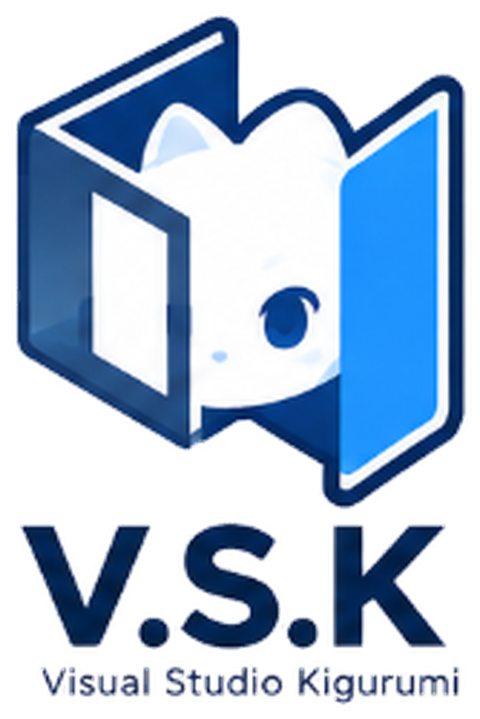

# Visual Studio Kigurumi (V.S.K)

[中文](README.zh-CN.md) | English

<p align="center">
  <picture>
    <source media="(prefers-color-scheme: dark)" srcset="docs/logo-dark-mode.png" />
    
  </picture>
</p>

V.S.K is a web tool for designing kigurumi head shells. Upload character references, talk to the design assistant, and get a 2D character design, then a finished head-shell product view and a four-view sheet. Every image can also be adjusted by hand in a built-in editor, and every result is kept in the project's version history.

V.S.K is an independent project based on [KigCraft](https://kigcraft.com) by SeaRabbit / 海兔 (user group QQ 934715528). The conversational workflow, workspace and generation pipeline come from KigCraft; V.S.K adds pluggable model backends, a settings page, editor improvements and prompt tuning.

## How it works

Each character is a project. The assistant on the right drives a two-stage flow and stops for your approval before each paid step:

1. **Character design**: it analyses the references and generates a 2D design (front view, optionally four views). If something essential is missing or contradictory, such as which character is meant or hidden ears, it asks one short question first.
2. **Head shell**: once you approve a design, it generates the head-shell front view (product photo style). After you approve that, it generates the head-shell four-view sheet.

You can ask for changes in chat at any step, or edit the image yourself and save it as a new version. The assistant sees those versions too.

## Features

- **IDE-style workspace**: an explorer with references and the version tree, a tabbed canvas, the assistant panel and a status bar. Dark and light themes.
- **Manual editor** with live mesh deformation in the browser (no AI call):
  - proportion, face shape, eyes (size, lids, iris, tail), brows and mouth sliders, with draggable landmarks;
  - liquify and annotation;
  - local regeneration of a masked area.
  - Saving creates a new version (Ctrl+S).
- **Local drafts**: unsaved edits are kept per version in the browser (IndexedDB) and restored when you switch back or reload.
- **Settings page** (`/settings`):
  - choose the chat assistant LLM, the reference-analysis LLM and the image backend;
  - fill in API keys, endpoints and model names without editing `.env`.
- **Cost guards**: approval checkpoints between stages, plus a per-message generation cap (`AGENT_MAX_GENERATIONS_PER_TURN`).
- **Languages**: Chinese, English and Japanese UI.

## Quick start (Windows, no Docker)

Local development needs no Docker. Jobs run inside the API process, state lives in SQLite and outputs go to `runtime/`.

```powershell
Copy-Item .env.example .env
.\scripts\start-local.ps1
```

The script:

- creates `backend\.venv` and installs frontend dependencies on first run;
- starts the API on `127.0.0.1:18000` and the app on <http://localhost:5173>;
- `-Lan` makes the app reachable from other devices on your network;
- Ctrl+C stops both.

Then open **Settings** (gear icon, top right), pick your backends and enter their API keys.

## Backends

There are three roles, each configured separately on the settings page or in `.env`:

| Role | Setting | Options |
| --- | --- | --- |
| Chat assistant (calls the tools) | `AGENT_LLM_PROVIDER` | `openai_compatible` (any OpenAI-compatible API with tool calling; default Volcengine Ark `doubao-seed-2-0-pro`), `claude_code` |
| Reference analysis (safety check + details) | `LLM_PROVIDER` | `openai_compatible` (needs a vision model), `codex`, `claude_code` |
| Image generation | `IMAGE_PROVIDER` | `ark` (Seedream), `siliconflow` (Qwen-Image-Edit), `codex`, `codex_bridge` |

A setup with only one Volcengine Ark Agent Plan key:

```dotenv
AGENT_LLM_PROVIDER=openai_compatible
LLM_PROVIDER=openai_compatible
IMAGE_PROVIDER=ark
ARK_API_KEY=your-agent-plan-key
```

Empty analysis and assistant keys fall back to the Ark key when they use the Ark endpoint.

### Where settings are stored

- Values saved on the settings page go to `runtime/settings-overrides.json` and take precedence over `.env`. "Reset all to .env" removes them.
- API keys are write-only: the page only shows whether a key is set and its last four characters.
- Keys are stored in plain text on this machine. `runtime/` is gitignored.
- With `APP_ENV=production` the settings page is read-only.

### Backend notes

- **Volcengine Ark**: needs the Agent Plan dedicated key; other Ark keys do not work.
  - Up to `ARK_MAX_REFERENCE_IMAGES` references are sent per request (default 4); the rest are merged into one contact sheet.
  - Four-view sheets request `1920x1280` by default.
- **SiliconFlow**: sends at most three images per request.
  - Local revision only edits the masked crop and composites it back.
  - Try the API with `tools\siliconflow_probe.py`.
- **Codex / Claude Code**: use the logged-in CLI on the host, so no API key is needed but each step is slower.
  - `codex_bridge` runs Codex outside the backend container; start it with `tools\start_codex_bridge.ps1` and set `CODEX_BRIDGE_TOKEN`.
  - Claude cannot generate images, so it only serves the LLM roles.
- All generated images carry V.S.K's own "AI generated" watermark. Platform watermarks are turned off.

### Product reference images (optional)

The repository does not ship product photos. To constrain the finished head-shell style (background, shell material, wig texture, lighting), put your own PNGs in `ref/` (gitignored):

| File | Used for |
| --- | --- |
| `ref/product-reference.png` | head-shell front view |
| `ref/turnaround-reference.png` | head-shell four-view sheet |

The photo only sets the finished-product look (matte shell, lens eyes, wig, lighting); the character comes entirely from the design. Use a front close-up of a head shell with its wig on a plain background, without stands, text or watermarks (`CODEX_PRODUCT_REFERENCE_PATH` sets the path). With `HEAD_SHELL_EDIT_STYLE_PHOTO=true` the front is made by editing this photo into your character instead: more photographic, but the face drifts toward the photo's character.

## Docker

```powershell
Copy-Item .env.example .env   # replace every change-me-* value first
docker compose up --build
```

The app runs at <http://localhost:15173> and the API at <http://localhost:18000/health>.

To use the CLI backends, mount logged-in config directories:

- Codex: copy `%USERPROFILE%\.codex` to `runtime\codex-home`, or set `CODEX_CONFIG_DIR` on Linux.
- Claude Code: copy `%USERPROFILE%\.claude` to `runtime\claude-home`. On macOS the login lives in the Keychain, so copy the directory from a Linux or Windows host instead.

## Deployment

On the server, create a production `.env` with at least:

- `APP_ENV=production`
- `ALLOW_FIXTURE_GENERATION=false`
- strong values for `POSTGRES_PASSWORD`, `MINIO_ROOT_PASSWORD`, `JWT_SECRET` and `ADMIN_AUDIT_PASSWORD`
- `CORS_ALLOWED_ORIGINS`
- your backends and keys

Then deploy the current commit:

```powershell
.\scripts\deploy-ssh.ps1 -KeyPath "$env:USERPROFILE\.ssh\id_ed25519" -SshTarget "deploy@example.com" -RemoteAppDir "/opt/vsk"
```

The script uploads a `git archive`, refuses fixture generation in production and rebuilds the containers.

Never commit `.env` or `runtime/settings-overrides.json`; both may contain keys.

## Development

```powershell
# frontend
cd frontend; npm install; npm run dev; npm test

# backend
cd backend
python -m venv .venv
.\.venv\Scripts\python -m pip install -e .[dev]
.\.venv\Scripts\python -m pytest
```

Design notes are in [docs/plans](docs/plans/). Current status and implementation details are in [docs/handover.md](docs/handover.md).

## License

GPL-3.0-or-later, following the upstream KigCraft license. See [LICENSE](LICENSE).
